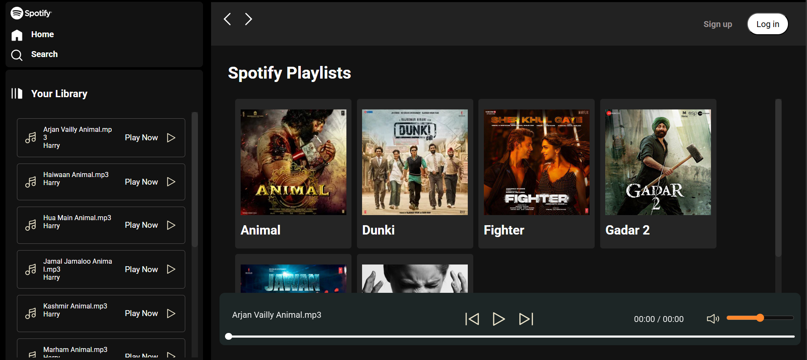

# 🎵 Spotify Clone (Frontend Only)

A responsive front-end clone of Spotify built using **HTML**, **CSS**, and **JavaScript**, replicating the UI and feel of the original Spotify app — without API integration.

---

## 🚀 Features

- 🎧 Custom music player (Play, Pause, Seek)
- 🎨 Fully responsive layout for desktop and mobile
- 🎵 Preloaded songs with album cover and info
- 🌓 Modern UI inspired by Spotify
- ⚡ Smooth interaction using vanilla JavaScript

---

## 📸 Demo



> 🔗 **Live Demo:** [https://spotify-clone-kaif.netlify.app/]

---

## 🛠️ Built With

- **HTML5**
- **CSS3** (Flexbox, Grid)
- **JavaScript** (ES6)

---

## 📂 Folder Structure

```
spotify-clone/
│
├── index.html
├── style.css
├── script.js
├── assets/
│   ├── images/
│   │   └── demo.png
│   └── music/
└── README.md
```

---

## ⚙️ Getting Started

1. **Clone the repository:**

```bash
git clone https://github.com/kaif13/Spotify-Clone
```

2. **Navigate into the folder:**

```bash
cd spotify-clone
```

3. **Open in browser:**

Simply open `index.html` in any web browser. No server setup needed.

---

## 🧪 Future Enhancements

- Integrate Spotify API for real tracks and authentication
- Add search functionality
- Create custom playlists
- User login and dark/light theme toggle

---

## 📝 License

This project is intended for educational use only. It is not affiliated with or endorsed by Spotify.
